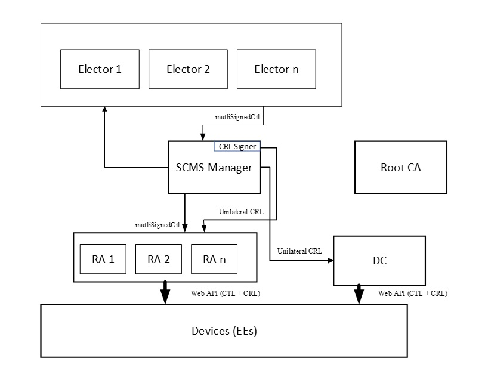

# Primer on ITS Cryptography

## Credential Management Systems

Credential Management Systems provide trust services for modern ITS, allowing ITS services and components to establish trust relationships, authenticate peers, authorize device behavior, and protect privacy across distributed and safety-critical operating environments. A Credential Management System issues, manages and revokes cryptographic credentials that enable vehicles, RSUs, and backend services to securely exchange information. 

In North America and other regions, the credential management function is performed by a Security Credential Management System (SCMS). The SCMS is a distributed credential management system designed specifically to enable V2X and ITS trusted communications. In Europe, credential management is provided through a Cooperative ITS Credential Management System (CCMS) framework. The European CCMS can be considered more centralized when compared with the North American SCMS architecture. 

### Certificate Management System Components

Both SCMS and CCMS architectures introduce a hierarchy of certificate authorities (CAs) and other components, each with a distinct role in establishing trust, authorizing behavior, and preserving privacy.  An example SCMS architecture is provided below. 

These authorities work together to ensure that devices can securely participate in ITS communications without exposing long-term identity or enabling unauthorized behavior.

- Electors: An SCMS-specific governance component responsible for establishing and maintaining trust relationships between independent SCMS deployments. Electors participate in decisions about which Root CAs and peer SCMS's are trusted, and these decisions are reflected in the CTL. Electors provide a mechanism for coordinated trust establishment across organizational and jurisdictional boundaries.
- A Root Certificate Authority (Root CA) provides the cryptographic starting point for one or more certificate chains within the SCMS. It issues certificates to subordinate authorities, such as enrollment and authorization authorities, but does not by itself establish trust at the device level. In an SCMS architecture, an ITS device only trusts a Root CA's certificates if that Root CA is included the ITS device's Certificate Trust List (CTL). 
- The Enrollment Certificate Authority (ECA) issues enrollment certificates that establish a device’s eligibility to participate in the credential management system. Enrollment certificates are typically long lived and are used for authentication during provisioning, management, and certificate request processes. Possession of an enrollment certificate does not grant authorization to transmit operational ITS messages.
- The Authorization Certificate Authority (ACA) issues authorization certificates, commonly referred to as pseudonym certificates. These certificates are used for operational messaging and include application identifiers and associated permissions. Authorization certificates are short lived and are rotated to support privacy requirements. The Authorization Certificate Authority operates without access to long term device identity information, enforcing separation between identity and operational behavior.
- Linkage Authority (LA) supports accountability while preserving privacy. It generates and manages cryptographic linkage values that are embedded into pseudonym certificates. These linkage values cannot be used to track devices during normal operations and can only be resolved through authorized processes involving multiple independent authorities, enabling conditional identification and revocation in cases of misbehavior.
- Registration Authority (RA) acts as a policy enforcement and validation function within the credential management system. It verifies certificate requests, ensures that devices are authorized to request specific certificate types and permissions. 
- Distribution Center (DC) provides a distribution point for files to be sent to ITS devices. ITS devices implement an Application Programming Interface (API) per IEEE 1609.2.1 Specification guidelines that allows for the secure delivery of CRLs and CTLs. 

### Trust Anchors

An SCMS architecture relies on a Certificate Trust List (CTL) as the root of trust. The CTL explicitly defines which certificate authorities are trusted and the scope under which they are trusted. ITS devices rely on the CTL when validating certificates, reconstructing implicit public keys, and enforcing application-level authorization. No certificate authority is trusted unless it is explicitly referenced in the CTL. ITS devices rely on the CTL to validate certificate issuers, reconstruct implicit public keys, and enforce authorization constraints.

The CTL is provisioned during manufacturing or enrollment and updated over time. Devices must manage CTL updates carefully, as stale trust information can lead to validation failures, interoperability issues, or delayed response to security incidents.

In Europe, trust between ITS deployments is coordinated using the C ITS Point of Contact Protocol. Rather than relying on a Certificate Trust List as defined in SCMS based systems, the C ITS Point of Contact Protocol provides a standardized mechanism for establishing and managing trust relationships between certificate authorities and operational domains across Europe. Through this protocol, participating entities exchange trust information, certificate authority references, and policy constraints that enable devices and backend systems to validate certificates and support interoperability across national and organizational boundaries.

### Certificate Types

ITS credential management systems use multiple certificate types to balance security, operational needs, scalability, and privacy. Different certificates serve different roles within the system, ranging from long-lived credentials used for provisioning and management to short-lived credentials used for operational messaging. Together, these certificate types enable trusted communications while preventing long-term tracking and unauthorized behavior.

#### Pseudonym Certificates

Pseudonym certificates are used for operational ITS messaging, such as V2X safety and mobility communications. They are intentionally designed to minimize linkability between messages while still enabling authentication and authorization.

- Pseudonym certificates are short lived and rotated frequently. They are used to sign V2X messages and are designed to prevent long term tracking of devices. Frequent rotation is a deliberate privacy mechanism.
- Non pseudonym certificates are longer lived and provide more stable identity binding. They are typically used for enrollment, backend services, and management functions rather than broadcast safety messaging.

Both certificate types may carry application permissions, but they serve different operational and privacy purposes.

##### Butterfly Key Expansion

To support large numbers of short-lived certificates at scale, ITS deployments rely on efficient key management techniques. Butterfly key expansion enables devices to generate many cryptographic keys without exposing private key material. Butterfly key expansion is a certificate generation technique that allows a device to derive many key pairs from a single initial key. The device retains exclusive knowledge of private keys, while the SCMS issues certificates for derived public keys. This approach supports large pseudonym certificate pools, frequent rotation, and strong separation between device identity and operational credentials. It is a critical enabler of scalable ITS deployments.

##### Linkage Values and Accountability

While pseudonym certificates protect privacy, ITS systems must still support accountability when misbehavior occurs. Linkage values provide this capability without enabling routine tracking. Pseudonym certificates include linkage values that support conditional accountability. During normal operations, these values cannot be used to track or correlate certificates. Linkage requires combining information held by multiple independent linkage authorities. No single authority can perform linkage alone. This design preserves privacy while allowing authorized investigation and revocation when misbehavior is detected.

#### Explicit and Implicit Certificates

Certificate management systems also differ in how cryptographic public keys are represented within certificates. This distinction affects bandwidth usage, storage requirements, and validation complexity. 

- Explicit certificates include the public key directly within the certificate. This simplifies validation and inspection but increases certificate size.
- Implicit certificates do not contain an explicit public key. Instead, the receiving device reconstructs the public key using certificate data and issuer information. Implicit certificates reduce bandwidth and storage requirements and are commonly used with large pseudonym certificate populations.

The choice between explicit and implicit certificates reflects a tradeoff between simplicity and scalability.

### Entitlements

In ITS credential management systems, entitlements define what a device is allowed to do, not who the device is. Entitlements are expressed by binding application identifiers and associated permissions into certificates, enabling receiving devices to make authorization decisions based on the intended use of a message rather than the long-term identity of the sender. This model supports interoperability, scalable authorization, and privacy-preserving communications across diverse ITS deployments.

Each ITS application or service is identified by an application identifier, referred to as a Provider Service Identifier (PSID) in North American deployments and an ITS Application Identifier (ITS-AID) in European deployments. These identifiers uniquely designate the application context under which a message is generated and processed. Authorization decisions are evaluated per PSID or ITS-AID rather than per device, allowing a single device to participate in multiple ITS services with distinct permissions and constraints.

Service Specific Permissions (SSPs) are associated with PSIDs or ITS-AIDs and define the permitted behaviors for a given application. SSPs constrain how an application may behave, such as the types of messages it may generate, operational limits, or contextual restrictions. They are evaluated by receiving devices during message processing to determine whether a message is authorized within its declared application context.

Together, application identifiers and SSPs form the core authorization model for ITS communications. This approach enables fine-grained, application-level authorization while avoiding reliance on persistent device identities, supporting both security and privacy objectives.

#### Role and Entitlement Binding

Role and entitlement binding occurs during enrollment and certificate issuance, where policy decisions are made regarding which applications and permissions a device is authorized to assert. These decisions are based on deployment context, operational role, and governing policy. 

Once issued, entitlements are cryptographically bound into certificates and cannot be modified by the device. Devices cannot self-declare roles or permissions. Enforcement occurs at message receipt, where receiving devices validate application identifiers and SSPs, and through monitoring and misbehavior detection mechanisms that identify misuse or policy violations over time.

### ITS Device Certificate Management 

#### Certificate File Management

ITS devices must be able to manage the files provided by the credential management service. In an SCMS architecture, this includes certificates, Certificate Revocation Lists (CRLs), and the Certificate Trust List (CTL). Proper handling of these files is important for maintaining trust, enforcing authorization decisions, and enabling interoperability across jurisdictions. 

ITS devices store and process certificate chains associated with received messages, including issuer certificates needed to validate signatures and reconstruct public keys when implicit certificates are used. Devices must also manage updates to trust and revocation information over time, ensuring that validation decisions reflect current policy and security state rather than stale or incomplete data.

##### Certificate Trust list Management

The Certificate Trust List defines which certificate authorities are trusted by an ITS device and the scope under which that trust applies. Devices rely on the CTL when validating certificate chains, reconstructing implicit public keys, and enforcing application-level authorization constraints. No certificate authority is trusted unless it is explicitly referenced in the CTL.

CTLs are typically provisioned during manufacturing or enrollment and updated periodically. Devices must be capable of securely storing CTLs, validating CTL authenticity and integrity, and applying updates without disrupting operational messaging. Failure to manage CTLs correctly can result in trust failures, loss of interoperability, or acceptance of unauthorized certificates.

##### Certificate Revocation List (CRL) Management

Certificate Revocation Lists provide a mechanism for invalidating certificates that are no longer authorized for use, such as those associated with compromised devices or confirmed misbehavior. ITS devices use CRLs to determine whether a certificate that would otherwise validate should be rejected.

#### Pseudonym Certificate Rotation

Pseudonym certificate rotation is a core privacy mechanism in ITS credential management systems. Because operational ITS messages are broadcast and may be observed by multiple parties, long-lived certificates would allow messages to be correlated over time, enabling tracking of vehicles or infrastructure devices. Rotating pseudonym certificates limits this linkability by ensuring that no single certificate is used long enough to establish persistent identity or movement patterns.

Pseudonym certificates are rotated to reduce linkability and tracking risk. Rotation may be based on time, usage, or operational context. ITS devices manage local certificate inventories and select active certificates according to policy. Rotation is performed autonomously without requiring network interaction at the moment of change, ensuring uninterrupted operation even in disconnected or constrained environments. Improper rotation configuration can lead to privacy loss, certificate exhaustion, or operational disruption.